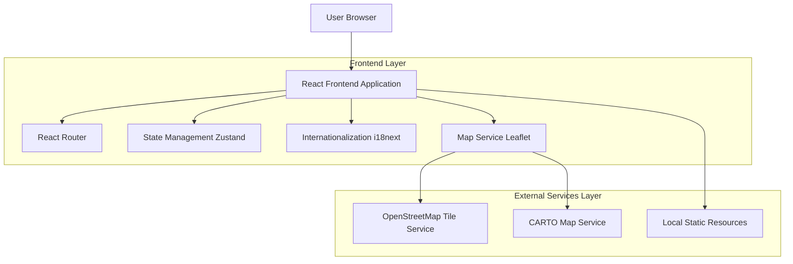
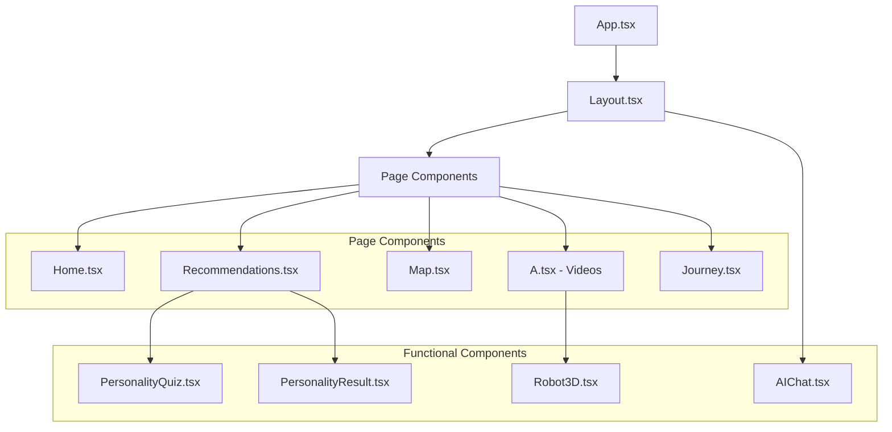
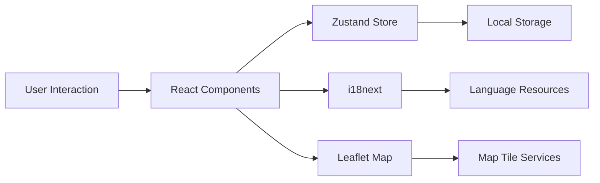
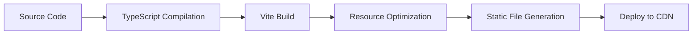

# Myanmar Culture Show Platform - Technical Architecture Documentation

## 1. Architecture Design



## 2. Technology Stack Description

### 2.1 Core Framework
- **Frontend**: React@18.3.1 + TypeScript + Vite@6.3.5
- **Styling**: TailwindCSS@3.4.17 + PostCSS + Autoprefixer
- **Build Tool**: Vite (based on Rollup)

### 2.2 Main Dependencies
- **Routing**: React Router DOM@7.9.3
- **State Management**: Zustand@5.0.3
- **Internationalization**: i18next@25.5.2 + react-i18next@16.0.0
- **Map Components**: Leaflet@1.9.4 + @types/leaflet@1.9.20
- **Icon Library**: Lucide React@0.511.0
- **Utility Libraries**: clsx@2.1.1 + tailwind-merge@3.0.2

### 2.3 Development Tools
- **Code Linting**: ESLint@9.25.0 + TypeScript ESLint@8.30.1
- **Type Checking**: TypeScript@5.8.3
- **Path Resolution**: vite-tsconfig-paths@5.1.4

## 3. Route Definitions

| Route | Component | Function Description |
|-------|-----------|---------------------|
| `/` | Home | Homepage with project introduction and navigation entry |
| `/recommendations` | Recommendations | Personalized recommendation system with personality test |
| `/map` | Map | Interactive Myanmar map display |
| `/videos` | A (Videos) | Postcard display and video playback |
| `/journey` | Journey | AI flight simulation experience |

## 4. Core Module Architecture

### 4.1 Component Architecture



### 4.2 Data Flow Architecture



## 5. Core Module Implementation

### 5.1 Personalized Recommendation System

#### Data Structure
```typescript
interface PersonalityQuestion {
  id: number;
  question: string;
  questionEn: string;
  options: Array<{
    text: string;
    textEn: string;
    traits: Record<string, number>;
  }>;
}

interface PersonalityResult {
  traits: Record<string, number>;
  recommendedCity: string;
  reasoning: string;
  reasoningEn: string;
}
```

#### Algorithm Implementation
- **Trait Calculation**: Accumulate trait scores across dimensions based on user choices
- **City Matching**: Calculate similarity between user traits and city characteristics
- **Recommendation Generation**: Select the city with highest similarity and generate reasoning

### 5.2 Map System

#### Technical Implementation
```typescript
// Map initialization
const map = L.map(mapRef.current).setView([20.0, 96.0], 6);

// Multi-tile layer support
const tileProviders = [
  {
    name: 'CARTO Light',
    url: 'https://{s}.basemaps.cartocdn.com/light_all/{z}/{x}/{y}{r}.png'
  },
  {
    name: 'OpenStreetMap',
    url: 'https://{s}.tile.openstreetmap.org/{z}/{x}/{y}.png'
  }
];

// City markers
const customIcon = L.divIcon({
  html: iconHtml,
  className: 'custom-marker',
  iconSize: [30, 30]
});
```

#### Features
- **Multi-tile Layers**: Support for multiple map service providers
- **Custom Markers**: HTML/CSS customized city marker styles
- **Responsive Design**: Adapts to different screen sizes
- **Error Recovery**: Automatic service provider switching on tile loading failure

### 5.3 Flight Simulation System

#### Core Algorithm
```typescript
// Bezier curve path calculation
const calculateFlightPath = (start: LatLng, end: LatLng): LatLng[] => {
  const controlPoint1 = {
    lat: start.lat + (end.lat - start.lat) * 0.3,
    lng: start.lng + (end.lng - start.lng) * 0.3 + 10
  };
  
  const controlPoint2 = {
    lat: start.lat + (end.lat - start.lat) * 0.7,
    lng: start.lng + (end.lng - start.lng) * 0.7 + 5
  };
  
  return generateBezierPath(start, controlPoint1, controlPoint2, end);
};

// Animation frame update
const animateFlightStep = () => {
  if (currentStep < flightPath.length - 1) {
    setCurrentStep(prev => prev + 1);
    updatePlanePosition(flightPath[currentStep]);
    requestAnimationFrame(animateFlightStep);
  }
};
```

#### Functional Features
- **Smooth Paths**: Natural flight trajectories using Bezier curves
- **Real-time Animation**: Smooth animations based on requestAnimationFrame
- **Progress Tracking**: Real-time display of flight progress and position information
- **Offline Support**: Degraded handling during network exceptions

### 5.4 Internationalization System

#### Configuration Structure
```typescript
const resources = {
  en: {
    translation: {
      nav: { home: 'Home', map: 'Map', videos: 'Videos' },
      home: { title: 'Myanmar Culture Show', description: '...' },
      // ... more translation content
    }
  },
  zh: {
    translation: {
      nav: { home: '首页', map: '地图', videos: '视频' },
      home: { title: '缅甸文化展示', description: '...' },
      // ... more translation content
    }
  }
};
```

#### Implementation Features
- **Dynamic Switching**: Runtime language switching without page refresh
- **Local Storage**: Persistent storage of user language preferences
- **Type Safety**: TypeScript type checking for translation keys
- **Lazy Loading**: Support for on-demand language pack loading

## 6. Data Models

### 6.1 City Data Model

```typescript
interface City {
  id: string;
  name: string;
  nameEn: string;
  coordinates: {
    lat: number;
    lng: number;
  };
  description: string;
  descriptionEn: string;
  images: {
    postcard_front: string;
    postcard_back: string;
    thumbnail: string;
  };
  videos: {
    culture: string;
    landscape: string;
  };
  traits: {
    adventure: number;
    culture: number;
    nature: number;
    history: number;
    relaxation: number;
  };
}
```

### 6.2 User State Model

```typescript
interface UserState {
  language: 'zh' | 'en';
  personalityResult?: PersonalityResult;
  recommendedCity?: string;
  testCompleted: boolean;
  preferences: {
    theme: 'light' | 'dark';
    autoplay: boolean;
  };
}
```

## 7. Performance Optimization Strategies

### 7.1 Code Splitting
- **Route-level Splitting**: Page-level code splitting using React.lazy()
- **Component-level Splitting**: On-demand loading of large components
- **Third-party Library Splitting**: Separate bundling of large dependency libraries

### 7.2 Resource Optimization
- **Image Lazy Loading**: Using Intersection Observer API
- **Video Preloading**: Intelligent preloading strategies
- **Font Optimization**: Using font-display: swap

### 7.3 Caching Strategies
- **Static Resource Caching**: Long-term caching + version control
- **API Response Caching**: Local storage caching mechanism
- **Component State Caching**: Zustand persistence

## 8. Deployment Architecture

### 8.1 Build Process



### 8.2 Deployment Configuration

#### Vercel Configuration (vercel.json)
```json
{
  "rewrites": [
    {
      "source": "/(.*)",
      "destination": "/index.html"
    }
  ]
}
```

#### Build Optimization
```typescript
// vite.config.ts
export default defineConfig({
  build: {
    sourcemap: 'hidden',
    rollupOptions: {
      output: {
        manualChunks: {
          vendor: ['react', 'react-dom'],
          router: ['react-router-dom'],
          maps: ['leaflet']
        }
      }
    }
  }
});
```

## 9. Security Considerations

### 9.1 Frontend Security
- **XSS Protection**: React built-in XSS protection + Content Security Policy
- **Dependency Security**: Regular dependency updates, using npm audit
- **Sensitive Information**: No hardcoded API keys or sensitive information

### 9.2 Data Security
- **Local Storage**: Only store non-sensitive user preference data
- **Transmission Security**: HTTPS enforced encrypted transmission
- **Third-party Services**: Only use trusted public services

## 10. Monitoring and Maintenance

### 10.1 Error Monitoring
- **Error Boundaries**: React Error Boundary to catch component errors
- **Console Logging**: Detailed logs in development, simplified logs in production
- **User Feedback**: User-friendly prompts when errors occur

### 10.2 Performance Monitoring
- **Core Web Vitals**: Key performance metrics monitoring
- **Resource Loading**: Monitor static resource loading performance
- **User Experience**: Interaction response time monitoring

## 11. Extensibility Design

### 11.1 Functional Extensions
- **Plugin System**: Modular functional plugin architecture
- **Theme System**: Extensible theme and styling system
- **Multi-language**: Easy addition of new language support

### 11.2 Technical Extensions
- **State Management**: Zustand can easily extend to complex state management
- **Component Library**: Can be extracted as an independent component library
- **Micro-frontend**: Support for micro-frontend architecture transformation

---

This technical documentation provides a comprehensive description of the Myanmar Culture Show Platform's complete technical architecture, offering the development team a thorough technical reference and implementation guide.