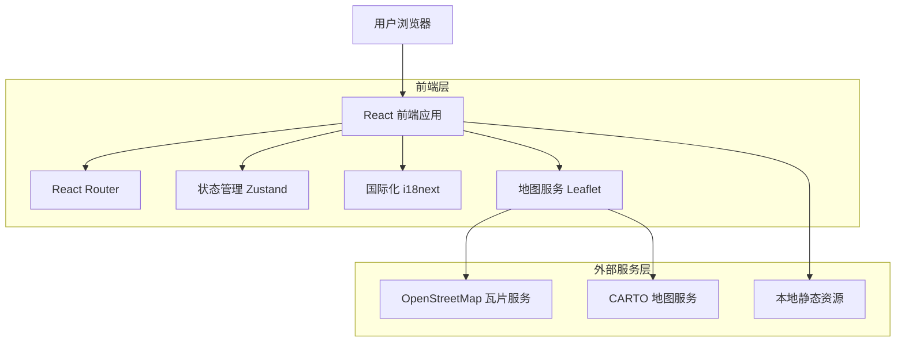
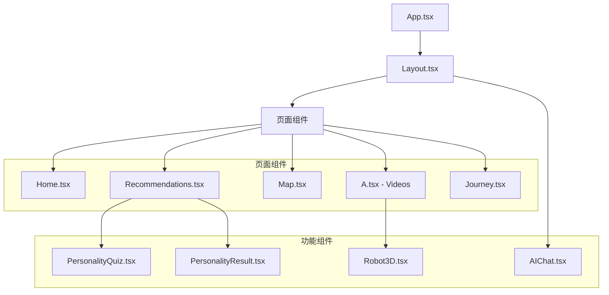
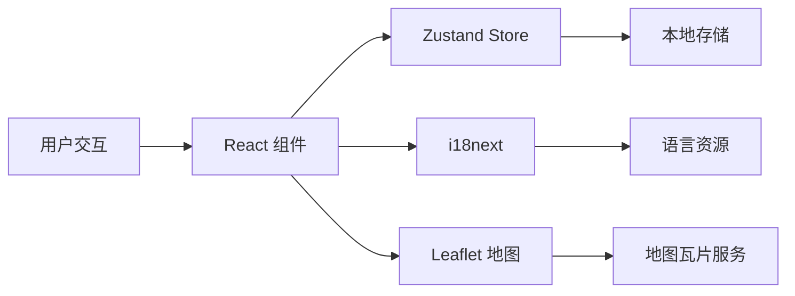
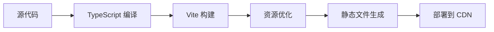

# 缅甸文化展示平台 - 技术架构文档

## 1. 架构设计



## 2. 技术栈描述

### 2.1 核心框架
- **前端**: React@18.3.1 + TypeScript + Vite@6.3.5
- **样式**: TailwindCSS@3.4.17 + PostCSS + Autoprefixer
- **构建工具**: Vite (基于 Rollup)

### 2.2 主要依赖
- **路由管理**: React Router DOM@7.9.3
- **状态管理**: Zustand@5.0.3
- **国际化**: i18next@25.5.2 + react-i18next@16.0.0
- **地图组件**: Leaflet@1.9.4 + @types/leaflet@1.9.20
- **图标库**: Lucide React@0.511.0
- **工具库**: clsx@2.1.1 + tailwind-merge@3.0.2

### 2.3 开发工具
- **代码检查**: ESLint@9.25.0 + TypeScript ESLint@8.30.1
- **类型检查**: TypeScript@5.8.3
- **路径解析**: vite-tsconfig-paths@5.1.4

## 3. 路由定义

| 路由 | 组件 | 功能描述 |
|------|------|----------|
| `/` | Home | 主页，项目介绍和导航入口 |
| `/recommendations` | Recommendations | 个性化推荐系统，包含性格测试 |
| `/map` | Map | 交互式缅甸地图展示 |
| `/videos` | A (Videos) | 明信片展示和视频播放 |
| `/journey` | Journey | AI 飞行模拟体验 |

## 4. 核心模块架构

### 4.1 组件架构



### 4.2 数据流架构



## 5. 核心模块实现

### 5.1 个性化推荐系统

#### 数据结构
```typescript
interface PersonalityQuestion {
  id: number;
  question: string;
  questionEn: string;
  options: Array<{
    text: string;
    textEn: string;
    traits: Record<string, number>;
  }>;
}

interface PersonalityResult {
  traits: Record<string, number>;
  recommendedCity: string;
  reasoning: string;
  reasoningEn: string;
}
```

#### 算法实现
- **特征计算**: 基于用户选择累加各维度特征分数
- **城市匹配**: 计算用户特征与城市特征的相似度
- **推荐生成**: 选择相似度最高的城市并生成推荐理由

### 5.2 地图系统

#### 技术实现
```typescript
// 地图初始化
const map = L.map(mapRef.current).setView([20.0, 96.0], 6);

// 多瓦片层支持
const tileProviders = [
  {
    name: 'CARTO Light',
    url: 'https://{s}.basemaps.cartocdn.com/light_all/{z}/{x}/{y}{r}.png'
  },
  {
    name: 'OpenStreetMap',
    url: 'https://{s}.tile.openstreetmap.org/{z}/{x}/{y}.png'
  }
];

// 城市标记
const customIcon = L.divIcon({
  html: iconHtml,
  className: 'custom-marker',
  iconSize: [30, 30]
});
```

#### 特性
- **多瓦片层**: 支持多个地图服务提供商
- **自定义标记**: HTML/CSS 自定义城市标记样式
- **响应式设计**: 适配不同屏幕尺寸
- **错误恢复**: 瓦片加载失败时自动切换服务商

### 5.3 飞行模拟系统

#### 核心算法
```typescript
// 贝塞尔曲线路径计算
const calculateFlightPath = (start: LatLng, end: LatLng): LatLng[] => {
  const controlPoint1 = {
    lat: start.lat + (end.lat - start.lat) * 0.3,
    lng: start.lng + (end.lng - start.lng) * 0.3 + 10
  };
  
  const controlPoint2 = {
    lat: start.lat + (end.lat - start.lat) * 0.7,
    lng: start.lng + (end.lng - start.lng) * 0.7 + 5
  };
  
  return generateBezierPath(start, controlPoint1, controlPoint2, end);
};

// 动画帧更新
const animateFlightStep = () => {
  if (currentStep < flightPath.length - 1) {
    setCurrentStep(prev => prev + 1);
    updatePlanePosition(flightPath[currentStep]);
    requestAnimationFrame(animateFlightStep);
  }
};
```

#### 功能特性
- **平滑路径**: 使用贝塞尔曲线生成自然飞行轨迹
- **实时动画**: 基于 requestAnimationFrame 的流畅动画
- **进度跟踪**: 实时显示飞行进度和位置信息
- **离线支持**: 网络异常时的降级处理

### 5.4 国际化系统

#### 配置结构
```typescript
const resources = {
  en: {
    translation: {
      nav: { home: 'Home', map: 'Map', videos: 'Videos' },
      home: { title: 'Myanmar Culture Show', description: '...' },
      // ... 更多翻译内容
    }
  },
  zh: {
    translation: {
      nav: { home: '首页', map: '地图', videos: '视频' },
      home: { title: '缅甸文化展示', description: '...' },
      // ... 更多翻译内容
    }
  }
};
```

#### 实现特性
- **动态切换**: 运行时语言切换无需刷新页面
- **本地存储**: 用户语言偏好持久化保存
- **类型安全**: TypeScript 类型检查翻译键
- **延迟加载**: 支持按需加载语言包

## 6. 数据模型

### 6.1 城市数据模型

```typescript
interface City {
  id: string;
  name: string;
  nameEn: string;
  coordinates: {
    lat: number;
    lng: number;
  };
  description: string;
  descriptionEn: string;
  images: {
    postcard_front: string;
    postcard_back: string;
    thumbnail: string;
  };
  videos: {
    culture: string;
    landscape: string;
  };
  traits: {
    adventure: number;
    culture: number;
    nature: number;
    history: number;
    relaxation: number;
  };
}
```

### 6.2 用户状态模型

```typescript
interface UserState {
  language: 'zh' | 'en';
  personalityResult?: PersonalityResult;
  recommendedCity?: string;
  testCompleted: boolean;
  preferences: {
    theme: 'light' | 'dark';
    autoplay: boolean;
  };
}
```

## 7. 性能优化策略

### 7.1 代码分割
- **路由级分割**: 使用 React.lazy() 实现页面级代码分割
- **组件级分割**: 大型组件按需加载
- **第三方库分割**: 将大型依赖库单独打包

### 7.2 资源优化
- **图片懒加载**: 使用 Intersection Observer API
- **视频预加载**: 智能预加载策略
- **字体优化**: 使用 font-display: swap

### 7.3 缓存策略
- **静态资源缓存**: 长期缓存 + 版本控制
- **API 响应缓存**: 本地存储缓存机制
- **组件状态缓存**: Zustand 持久化

## 8. 部署架构

### 8.1 构建流程



### 8.2 部署配置

#### Vercel 配置 (vercel.json)
```json
{
  "rewrites": [
    {
      "source": "/(.*)",
      "destination": "/index.html"
    }
  ]
}
```

#### 构建优化
```typescript
// vite.config.ts
export default defineConfig({
  build: {
    sourcemap: 'hidden',
    rollupOptions: {
      output: {
        manualChunks: {
          vendor: ['react', 'react-dom'],
          router: ['react-router-dom'],
          maps: ['leaflet']
        }
      }
    }
  }
});
```

## 9. 安全考虑

### 9.1 前端安全
- **XSS 防护**: React 内置 XSS 防护 + 内容安全策略
- **依赖安全**: 定期更新依赖库，使用 npm audit
- **敏感信息**: 无 API 密钥或敏感信息硬编码

### 9.2 数据安全
- **本地存储**: 仅存储非敏感用户偏好数据
- **传输安全**: HTTPS 强制加密传输
- **第三方服务**: 仅使用可信的公共服务

## 10. 监控和维护

### 10.1 错误监控
- **错误边界**: React Error Boundary 捕获组件错误
- **控制台日志**: 开发环境详细日志，生产环境精简日志
- **用户反馈**: 错误发生时的用户友好提示

### 10.2 性能监控
- **Core Web Vitals**: 关键性能指标监控
- **资源加载**: 监控静态资源加载性能
- **用户体验**: 交互响应时间监控

## 11. 扩展性设计

### 11.1 功能扩展
- **插件系统**: 模块化的功能插件架构
- **主题系统**: 可扩展的主题和样式系统
- **多语言**: 易于添加新语言支持

### 11.2 技术扩展
- **状态管理**: Zustand 可轻松扩展为复杂状态管理
- **组件库**: 可提取为独立的组件库
- **微前端**: 支持微前端架构改造

---

本技术文档详细描述了缅甸文化展示平台的完整技术架构，为开发团队提供了全面的技术参考和实施指南。